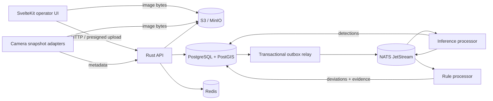

# Architecture

## Current decision and implementation status

**ADR 0005 supersedes the modular-monolith decision below.** The agreed target is seven independently
deployed services (identity, projects, schedule, observations, inference, deviations, notifications),
Kubernetes, NATS JetStream and one PostgreSQL cluster with isolated databases and roles. See
[ADR 0005](adr/0005-microservices-and-kubernetes.md) for ownership, consistency and deployment gates.

The sections below describe the original bootstrap, not the completed microservice target. The
schedule service, private synchronous inference service and a stateless deviations preview service
now exist; persistent observation, deviation and identity services do not. The main web workspace
explicitly demonstrates local synthetic data; the separate `/app/model` screen runs real model
inference and a sourced, evidence-gated plan preview when enabled.
Do not build new cross-domain handlers or shared persistence around the legacy API. Existing
Kustomize overlays deploy that bootstrap only and must be replaced as services are implemented.

## Design goal

The first release must provide a convincing end-to-end demonstration without locking the team into
a throwaway prototype. The architecture therefore separates stable product semantics from workloads
that scale differently, while keeping the number of deployable units small.

## Deployable workloads

### API control plane

The Rust/Axum API owns authentication boundaries, project configuration, schedule import, presigned
uploads and read models for the UI. It writes commands and outbox events in one PostgreSQL
transaction. The API never performs model inference inside an HTTP request.

### Inference processor

Target: an observations-owned job consumes `lct.observation.accepted.v1`, loads the image from object
storage, invokes a pinned model and persists normalized detections before an outbox publishes the
result. CPU and GPU serving replicas can scale independently. Current state: `apps/inference` serves
the supplied PyTorch YOLO26x and ConvNeXt checkpoints through a private authenticated HTTP endpoint,
with verified artifact hashes and a separate optional upload sandbox. Event consumption, detection
persistence and rule evaluation are not yet implemented. See [model serving](model-serving.md).

### Rule processor

The rule processor consumes analyzed observations, maintains a disposable time window in Redis and
compares aggregated counts with active schedule stages. It persists every emitted deviation with an
immutable snapshot of the rule, expected equipment, observed equipment and evidence ids.

Inference and rule processing may initially run in one binary. Their event and domain boundaries
remain explicit so they can scale independently when camera count grows.

## Storage responsibilities

| Component | Owns | Must not own |
|---|---|---|
| PostgreSQL/PostGIS | Projects, zones, schedule, rules, detections, deviations, audit and outbox | Image bytes or ephemeral locks |
| Redis | Sliding windows, deduplication leases, rate limits and short-lived job state | Evidence, schedules or final alerts |
| S3/MinIO | Original images, annotated evidence and versioned model artifacts | Searchable business metadata |
| NATS JetStream | Durable event delivery with replay and consumer offsets | Canonical business state |

## Consistency and failure handling

1. API stores the observation and an outbox event in one transaction.
2. An outbox relay publishes the event and marks it published.
3. A consumer writes its result and next outbox event in one transaction.
4. Consumers record processed event ids. Redelivery is harmless.
5. Asset SHA-256 plus request idempotency prevents duplicate images and commands.
6. A dead-letter stream receives messages that exceed the retry policy.

This gives at-least-once delivery without pretending the network can provide exactly-once execution.

## Security boundary

- Browser uploads use short-lived, content-type- and size-bound presigned URLs.
- Camera source credentials remain in Kubernetes Secrets or an external secret manager.
- API logs correlation ids and object keys, never image contents, tokens or RTSP URLs.
- Containers run without root, Linux capabilities or writable root filesystems.
- Evidence links are short-lived and project-scoped.

## Observability

Every request and event carries one correlation id. Logs are structured JSON. The production target
adds OpenTelemetry traces and metrics for queue lag, inference latency, rule latency, false-alert
feedback and dependency health. Liveness checks only the process; readiness checks PostgreSQL,
Redis and NATS before Kubernetes sends traffic.
