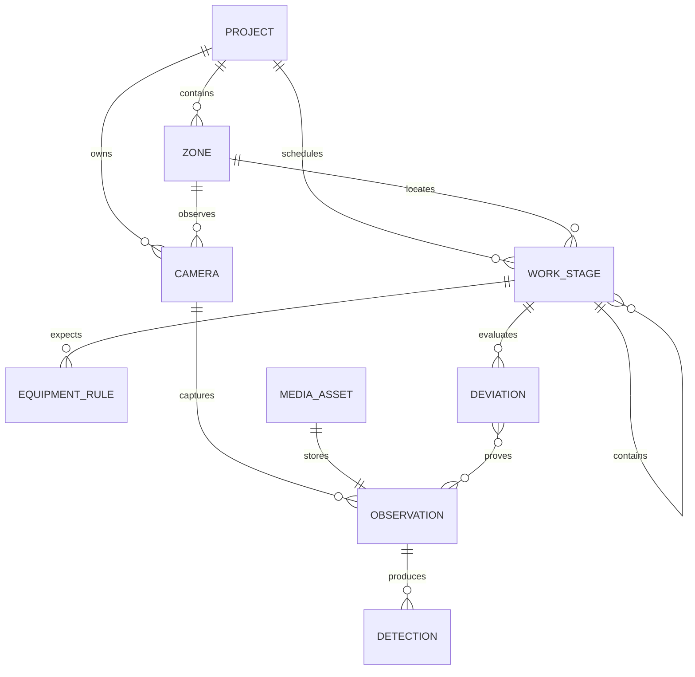

# Data model

## Core relationships

## Important semantics

### Stage codes are strings

WBS codes such as `10.1` and `12.3.7` are identifiers, not numbers or dates. The source workbook
already demonstrates why numeric spreadsheet storage is unsafe. Database and API contracts preserve
the original textual code.

### Schedule intervals are half-open

`planned_start` is inclusive and `planned_end` is exclusive. PostgreSQL materializes the pair as a
`tstzrange`, allowing fast queries for all active stages at an observation timestamp. Overlapping
stages are valid.

### Observability is explicit

`observable_from_camera=false` prevents the rule engine from declaring compliance or violation for
work that cannot be proven by an exterior camera. Such a stage produces `insufficient_evidence` only
when the UI or workflow needs an explicit result.

### Rules are count- and time-aware

Each rule defines an equipment class, expectation, count range, detector confidence threshold and
number of frames required before evaluation. This prevents a single occluded frame from becoming a
critical alert.

### Deviations are auditable

The mutable rule table is not sufficient for an audit. A deviation retains JSON snapshots of the
exact rule, expected state and observed state used at detection time. `deviation_evidence` points to
the original and annotated media assets.

### Images live outside PostgreSQL

`media_assets` stores immutable metadata, checksum and object key. Actual bytes live in S3-compatible
storage. The unique checksum makes retries and duplicate camera frames inexpensive to detect.

