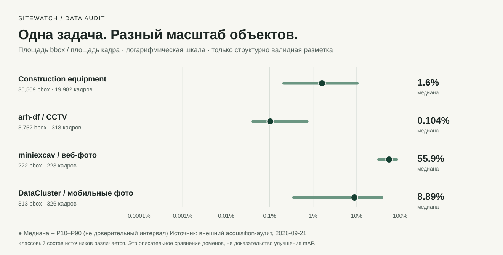

# Открытые датасеты: скачивание и первичный аудит

Проверено 2026-09-21. Это анализ исходных данных, **не результаты обучения**.

## Что получено

Скачаны четыре полных архива: **19 111 884 019 байт (~19,11 GB)**,
20 849 файлов изображений; 20 848 полностью декодируются. Исходники не изменялись
и не смешивались с организаторскими. Все архивы исключены из Git.

| Источник | Версия | Изображения | Файлы разметки: непустые / пустые / отклонённые | Валидные bbox |
|---|---|---:|---:|---:|
| [xyzyxzzxy / construction-equipment](https://www.kaggle.com/datasets/xyzyxzzxy/construction-equipment/data) | 1 | 19 982 | 17 198 / 2 699 / 85 | 35 509 |
| [kartaviychert / arh-df](https://www.kaggle.com/datasets/kartaviychert/arh-df?select=images) | 5 | 318 | 318 / 0 / 0 | 3 752 |
| [miniexcav / Construction-Machines-Images-Dataset](https://github.com/miniexcav/Construction-Machines-Images-Dataset) | `fc3e24b8401b87ed4b62488e459e5c915467da96` | 223 | 222 / 0 / 1 | 222 |
| [DataCluster / construction-vehicle-images](https://www.kaggle.com/datasets/dataclusterlabs/construction-vehicle-images) | 2 | 326 (325 декодируются) | 236 / 5 / 84; ещё 1 не проверен из-за JPEG | 313 |
| [jejung / construction-machinery-tbosw](https://universe.roboflow.com/jejung/construction-machinery-tbosw) | нет опубликованной | Не скачан: на странице 78 | Не проверено | Не проверено |

У Roboflow указаны 24 класса и 0 опубликованных версий. Переход к Dataset возвращает
страницу проекта без экспорта. Не подменяли набор превью-картинками и не создавали
несуществующую версию. Нужен ZIP от владельца или опубликованная версия; создание
fork/version в аккаунте — отдельное действие. Roboflow рекомендует публиковать raw-версию
для скачивания оригиналов: [документация автора платформы](https://blog.roboflow.com/sharing-on-roboflow-universe/).

Все количества bbox относятся **только к аннотациям, прошедшим структурную проверку**.
Если один bbox некорректен, файл целиком не входит в эту статистику. Пустой файл разметки
не доказывает отсутствие техники без проверки полноты. Непроверенные/неоднозначные классы
не превращались автоматически в классы SiteWatch.

## Самые важные находки

### 1. В исходном train/valid есть точная утечка

Проверены SHA-256 всех декодируемых изображений четырёх источников и 100 организаторских
кадров. Найдены **327 групп байтовых дублей**: 322 в большом Kaggle-наборе и 5 в miniexcav.
Всего 343 лишние копии относительно уникальных SHA-256.

**50 групп одного и того же файла пересекают train и valid** большого набора. У некоторых
копий отличаются названия камеры в имени файла. Поэтому ни имя, ни готовый split
поставщика не гарантируют независимость. Это прямой повод перестроить разбиение до
любого заявления о качестве. Насколько утечка меняет mAP, пока не измерено.

Дополнительно найдено 2 492 группы равного 64-bit dHash, в том числе 116 с пересечением
исходных train/valid. **Это кандидаты на визуальную проверку, а не 2 492 доказанных дубля.**
Повторяющийся фон камеры тоже может давать одинаковый dHash.

Между разными источниками, включая организаторский, точных SHA-совпадений и равных dHash
не найдено. Это **не доказательство отсутствия утечки**: кадры одной серии, кропы,
изменённые рамки и перекодирование могут не совпадать по этим признакам. Расстояния
Hamming > 0, визуальные эмбеддинги и группировка камер/видео ещё не проверены.

### 2. Большой набор не закрывает редкие классы

Валидные bbox восьми кандидатных базовых классов из `construction-equipment`:

| Исходный класс | Предлагаемый код SiteWatch | Bbox |
|---|---|---:|
| Excavator | `excavator` | 8 278 |
| Dump truck | `dump_truck` | 7 039 |
| Autocran | `mobile_crane` | 1 788 |
| Truck | `truck` | 1 304 |
| Mixer | `concrete_mixer` | 1 221 |
| Crane manipulator | `loader_crane` | 845 |
| Roller | `road_roller` | **20** |
| Bulldozer | `bulldozer` | **1** |

Маппинг — предложение по опубликованным названиям, ещё не семантическая валидация.
При таком дисбалансе нельзя обещать устойчивое распознавание восьми классов просто
потому, что скачаны 20 тысяч кадров. Катки и бульдозеры — приоритет для поиска/разметки;
отдельно нужны данные для расширенных `tower_crane` и `piling_rig`.

`arh-df` имеет другие пять классов: `crane`, `excavator`, `other`, `tractor`, `truck`.
`crane` нельзя автоматически сделать автокраном, `tractor` — бульдозером, `other` — фоном.
Каждый из 318 кадров содержит аннотации `crane` и `excavator`; это дополнительный сигнал
проверить временную/сценовую зависимость, а не считать 318 кадров независимыми стройками.

### 3. Масштаб объектов радикально различается



Медиана относительной площади валидного bbox: большой Kaggle-набор — **1,6014%**,
`arh-df` — **0,1037%**, miniexcav — **55,8573%**, DataCluster — **8,8897%**.
Площадь нормирована размером исходного кадра. На графике P10–P90 — распределение объектов,
не доверительный интервал и не качество модели. Классовый состав источников различается;
следующий шаг — сравнение внутри одного класса и независимых сцен.

Просмотренный пример `arh-df` действительно является общим видом стройки с мелкой техникой;
пример miniexcav — крупное изображение экскаватора на белом фоне с водяным знаком.
Это иллюстрации, не автоматическая классификация всех кадров. Вывод для эксперимента:
проверить разрешение и затем тайлинг, а перенос веб-фотографий на CCTV не считать гарантированным.

### 4. Разметку нельзя импортировать без проверки координат

- Большой источник: **85 файлов** с рамками за границей `[0,1]`.
- miniexcav: **1 файл**, `79.txt`, с `center_x=0.009`, `width=0.062`: левый край отрицателен.
- DataCluster: **1 JPEG не декодируется**; 84 VOC-файла имеют размеры, отличающиеся от
  raw-размеров изображения, и все соответствующие фото имеют EXIF orientation 6.
  В проверенном примере размеры XML совпадают с повёрнутой ориентацией. Нужна согласованная
  нормализация изображения и рамок с визуальной проверкой, не удаление всей этой группы
  под ярлыком «плохая разметка».
- Ещё у 216 декодируемых DataCluster-кадров указан нестандартный EXIF orientation 0.
  Это не 216 дополнительных повёрнутых изображений: значение следует отдельно нормализовать
  и проверить. Автоматического изменения байтов или координат в этом аудите нет.

Подробные имена, ошибки и bbox-площади находятся в локальных `image-records.json`.
Сырые файлы сохранены, чтобы каждое исправление можно было проверить и воспроизвести.

## Заявленные лицензии и допуск

| Источник | Что заявил издатель | Текущий статус |
|---|---|---|
| xyzyxzzxy | CC0 | Кандидат после проверки происхождения, семантики и утечки |
| arh-df | GPL 2 | Отдельная проверка условий использования/распространения |
| miniexcav | Отдельного LICENSE нет; README ограничивает назначение исследованиями/обучением и предупреждает о чужих правах на фото | Карантин до проверки прав |
| DataCluster | CC BY-NC-ND 4.0 | Ограниченный источник; не считать разрешёнными коммерческое использование и публикацию адаптированных данных |
| jejung | CC BY 4.0 на странице | Заблокирован отсутствием опубликованной версии |

Это реестр заявлений издателей и консервативных решений проекта, не юридическое заключение.
Публичный доступ сам по себе не гарантирует право включить фотографии или производные
материалы в релиз. DataCluster рекламирует большую коллекцию, но в скачанном архиве
**326 изображений**, а не 20 тысяч. Никаких платных данных не покупали и владельцам не писали.

## Воспроизведение и артефакты

- `ml/config/external-sources.json`: точные версии, публичные download URL и ограничения.
- `docs/external-data-audit.json`: агрегаты, размеры архивов, SHA-256 и подпись версии аудитора.
- `data/ml/external/<source-id>/source.zip`: неизменённые локальные архивы, не в Git.
- `data/ml/external/<source-id>/image-records.json`: пофайловые результаты, не в Git.
- `data/ml/external/acquisition-audit.json`: группы дублей с именами файлов, не в Git.
- `scripts/render-data-audit.py`: воспроизводимый SVG из агрегатов, без исходных фотографий.

Из корня репозитория:

```bash
ml/.venv/bin/python -m sitewatch_ml.external_data \
  --organizer data/ml/raw/organizer \
  --summary-output docs/external-data-audit.json
ml/.venv/bin/python scripts/render-data-audit.py
```

Для повторного использования отчётов можно добавить `--reuse`: проверяются SHA-256 архива,
код аудитора и конфигурация источника. Объём архивов требует примерно 20 GB свободного места;
аудит не распаковывает их полностью и не создаёт вторую копию набора.

Маршрут доступа: сначала проверены Kaggle MCP и официальный CLI. CLI подтвердил сохранённый
вход, но обновление авторизации MCP получило HTTP 429. Затем использованы публичные API
метаданных и версионированные ссылки скачивания Kaggle. Авторизационные данные не копировались
в проект; конфигурация MCP и аккаунта не менялась. GitHub скачан по конкретному commit SHA.

## Что ещё не сделано

Семантический аудит всех bbox, исправления EXIF/геометрии, исчерпывающий поиск похожих
кадров и scene-disjoint split, согласование лицензий и закрытый размеченный target test.
Ни один архив ещё не допущен в обучение автоматически. Модели на новых данных не обучались;
mAP, PR-кривые и результаты модельных гипотез отсутствуют.

Следующий пакет: очистка/группировка данных, доразметка редких классов и фиксация target
holdout. После этого — эксперименты по [заранее записанному протоколу](analysis-and-evaluation-plan.md).
