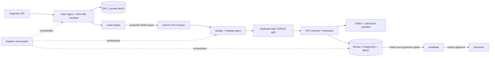

# MLOps: from organizer archive to production candidate

## What is implemented

The ML platform is deliberately split into five contracts:

1. **Dataset identity — DVC + MinIO.** Image bytes stay outside Git. SHA-256 manifests and the DVC
   lock make any experiment reproducible.
2. **Human truth — Label Studio.** The repository contains the fixed ten-class taxonomy and labeling
   UI. Exported rectangles are rejected on an unknown class, unsafe path, rotation or out-of-frame
   coordinates and are written atomically as YOLO labels.
3. **Quality and lineage — Dagster.** The asset graph shows ingestion, decoding, annotation coverage,
   duplicate-safe split and the MLflow audit run.
4. **Experiments and registry — MLflow.** PostgreSQL stores run/registry metadata; MinIO stores reports,
   weights and ONNX artifacts. Local commands fall back to SQLite, so the pipeline is still usable
   offline.
5. **Release — metric gate + aliases.** A successful train may register `candidate`; only an explicit
   promotion changes `champion`. The ONNX checksum is part of the model manifest.



## First run

Requirements: Docker, `uv` 0.11.7+ and Python 3.12. The source archive remains at the repository root.

```bash
cp .env.example .env
make ml-bootstrap
make ml-data
make mlops-up
make labeling-up
```

Interfaces:

- MLflow: `http://localhost:5050`
- Dagster: `http://localhost:3001`
- Label Studio: `http://localhost:8081`
- MinIO console: `http://localhost:9001`

`make ml-data` is expected to report `training_ready: false` until annotation is complete. This is a
quality gate, not a pipeline failure. The verified first-pass numbers are preserved in the
[dataset audit](dataset-audit.md).

## Annotation loop

1. Create a Label Studio project with [`ml/labeling/label_config.xml`](../ml/labeling/label_config.xml).
2. Import `data/ml/manifests/label-studio-tasks.json`.
3. Label every image, including completing empty images that contain no target equipment.
4. Export all tasks as Label Studio JSON.
5. Import and re-audit:

```bash
make ml-import-labels LABEL_EXPORT=/absolute/path/to/export.json
cd ml
uv run sitewatch-ml prepare
```

The importer replaces the complete YOLO label directory only after every supplied record validates,
stores the exact export at `data/ml/annotations/label-studio-export.json`, and refreshes
`data/ml/annotations.dvc`. The audit blocks training when the export is partial, corrupt or contains
invalid geometry.

## Reproduce and publish the dataset

The local DVC remote points to the private `sitewatch-datasets` bucket in MinIO. Credentials are read
from AWS environment variables and never committed.

```bash
make infra-up
cd ml
uv run --extra data dvc repro
uv run --extra data dvc push
```

Commit `dvc.yaml`, `dvc.lock`, `data/ml/annotations.dvc`, experiment YAML and code together. Do not
commit dataset bytes, source archives, credentials, weights or MLflow databases.

## Train, evaluate and promote

The heavyweight stack is isolated from the control-plane environment:

```bash
cd ml
uv sync --frozen --group dev --extra train
MLFLOW_TRACKING_URI=http://localhost:5050 \
  uv run sitewatch-ml train --experiment config/experiments/baseline.yaml
MLFLOW_TRACKING_URI=http://localhost:5050 \
  uv run sitewatch-ml train-classifier --experiment config/experiments/classifier-baseline.yaml
uv run sitewatch-ml promote --run-id <candidate-run-id>
uv run sitewatch-ml promote-classifier --run-id <gated-classifier-run-id>
```

The baseline logs all hyperparameters, dataset reports, split manifest, metrics, best checkpoint,
ONNX export and a checksum-bearing model manifest. Promotion thresholds live in the experiment YAML
and therefore participate in code review.
The classifier uses scene-disjoint object crops, train-only machine augmentations and a separate
top-1/macro-F1 gate. Neither model has been trained on the incomplete organizer labels yet;
these commands are gated by dataset readiness. Background-only weather synthesis and temporal
violation augmentation need masks/event ground truth and are not currently enabled; see
[`schedule-and-evidence-requirements.md`](schedule-and-evidence-requirements.md).

## Production shape

Compose is for the hackathon workstation. In Kubernetes, use managed PostgreSQL and S3, separate
Dagster webserver/daemon deployments, GPU training Jobs and a distinct inference Deployment that
resolves the MLflow `champion` alias to a pinned ONNX checksum. Secrets belong in an external secret
manager. Source images and evidence remain private and must never be placed in logs or public model
artifacts.

Before enabling automatic retraining, add reviewed annotations from production feedback, a fixed
golden test set, drift thresholds and an approval step. Automatic scheduling without those controls
would automate model degradation rather than MLOps.
