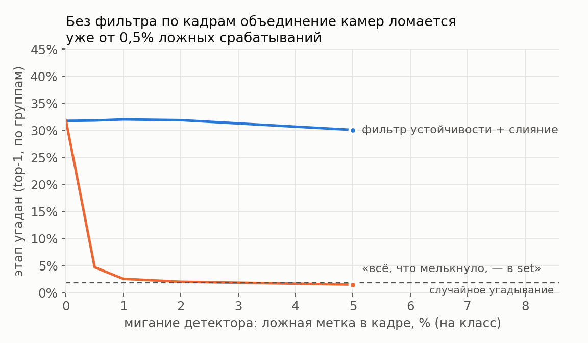
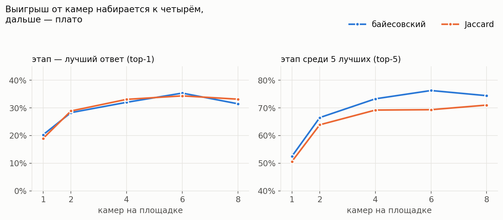
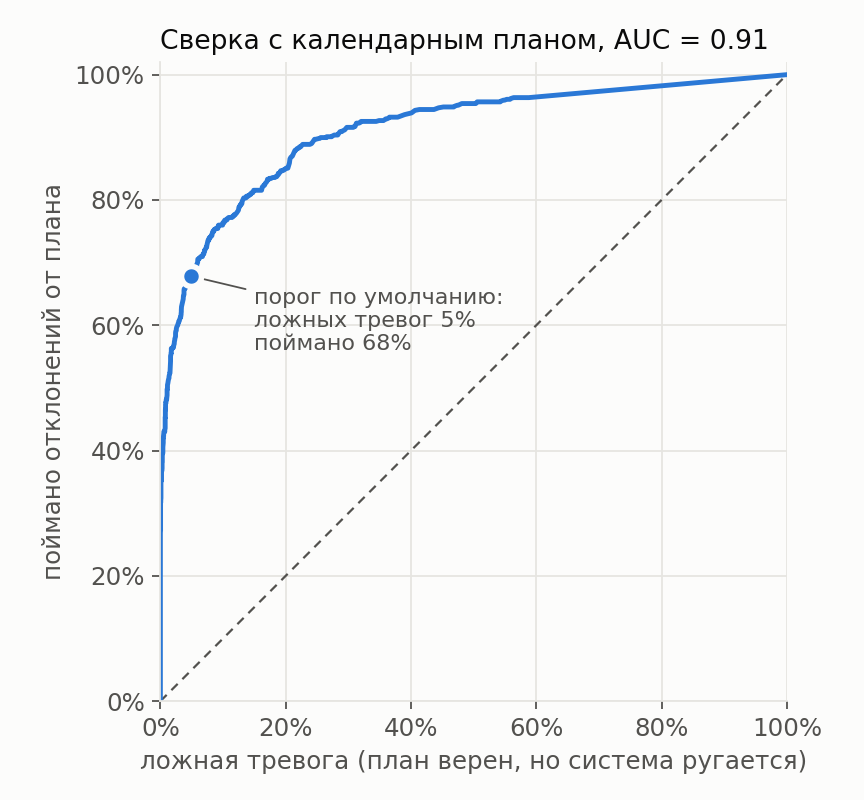
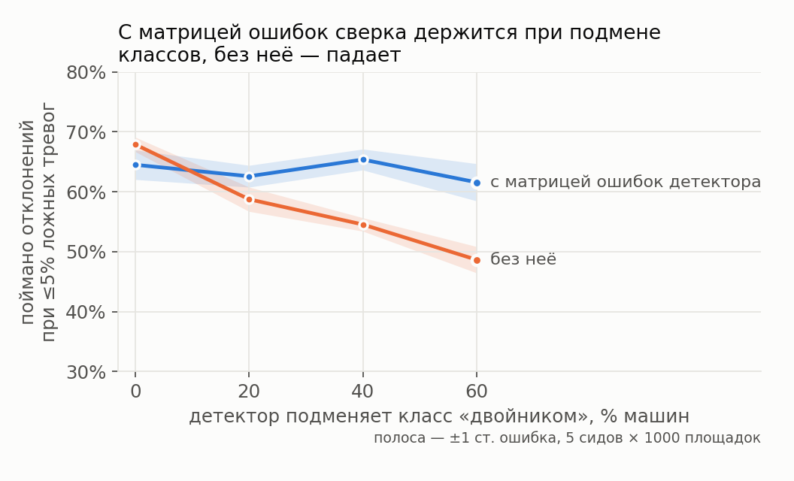
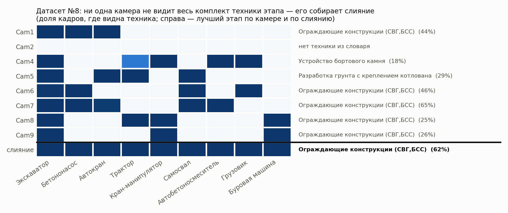

# Камеры → этап работ (третье направление)

Детекции со всех камер площадки за смену или день превращаются в две вещи:

- вероятности этапов из XLSX-перечня;
- вердикт по календарному плану: «согласуется» или «расходится», а также какой этап объясняет увиденную технику лучше.

Код не знает ни одной конкретной машины. Список техники, этапы и мост «метка детектора → техника» читаются из `data/stage_equipment.md`. Если техника поменяется, правится md, а код остаётся прежним. Это проверено на асфальтоукладчике (§7).

## 1. Что вообще можно различить по технике

- md задаёт 20 видов техники и 377 строк XLSX. Из них 31 строка сводная, 12 без техники, остаются **334 этапа-кандидата**.
- Разных наборов техники у этих 334 этапов всего **55**. Этапы с одинаковым набором по камерам неразличимы в принципе. Например, 45 этапов (электрика, сантехника, сети связи, разметка…) видны только по грузовику и газели.
- Поэтому система отвечает **группой неразличимых этапов** и **разделом перечня**. Конкретную строку внутри группы выбирает календарный план.
- Колонки md означают «возможное присутствие» и альтернативы, а не обязательный комплект. Если одной из допустимых машин нет, это не нарушение. От этого зависит выбор меры сходства (§3).

## 2. Пайплайн

```
детекции любых камер {camera, frame, label, conf} за смену/день
  │ 1. мост меток: словарь md (74 метки 9 датасетов) + extra_labels своего детектора
  │ 2. устойчивость: доля кадров камеры, где видна техника; < 15 % — мигание детектора
  │ 3. раннее слияние: noisy-OR по камерам → «что есть на площадке», 0…1 по видам техники
  │ 4. оценка этапов: байесовское правдоподобие × априорное, равномерное по группам
  │ 5. группы неразличимых этапов + свод по разделам перечня
  │ 6. позднее слияние: малый набор этапов, вместе объясняющий камеры → зоны работ
  │ 7. сверка с планом: отношение правдоподобий «лучший этап / плановый», порог 3.5
  ▼
JSON-отчёт — api.SiteAnalyzer.analyze
```

Синхронизировать камеры не нужно: этап длится дни, поэтому слияние идёт за смену или день. На датасете №8 камеры и не пересекаются по времени: у каждой свой ролик на 1–5 минут, ролики идут примерно раз в час с 14:10 до 21:47. К тому же часы в кадре расходятся со временем в имени файла на 16 минут. Методу это не мешает.

**Шаг 4: оценка.** Пусть у этапа s техника работы W и техника доставки D. Тогда

    P(вид k | s) = 0.75·[k∈W]/|W| + 0.15·[k∈D]/|D| + 0.10·фон(k),
    log P(улики | s) = Σ_k o_k · log P(k | s),

где o_k — устойчивость вида k после шага 3.

- Узкий этап, который объясняет увиденное, выигрывает у сводного, куда помещается всё. Это принцип размера.
- Фон — частота вида техники по md. Благодаря ему посторонняя машина на площадке не обнуляет этап.
- Априорное равномерно **по группам**, а не по строкам. Иначе выигрывали бы группы, которые в XLSX просто расписаны подробнее: у «Выноса сетей» 8–15 одинаковых строк.

**Шаг 6: зоны.** Если в разных зонах идут разные работы, одна «ближайшая» стадия по объединённому множеству оказывается ложной: выигрывает сводный этап. Поэтому набор этапов подбирается жадно по целевой функции

    Σ_камер max_{s ∈ набор} log P(улики камеры | s) − 2·|набор|.

Камера, которая видит одну логистику, зону не образует. Логистика — это самосвал, грузовик, газель и прицеп. Список не задан в коде, а выводится из md: этих видов нет ни в одной колонке «работа».

**Шаг 7: сверка с планом.**

    LR = max_s log P(улики | s) − max_{s ∈ план} log P(улики | s)

LR считается только по уликам, без априорного. Апостериорное уже содержит план, и первая версия проверки, которая сравнивала план с самим собой, ловила всего 22 % отклонений. Если LR > 3.5, то есть другой этап объясняет технику в e^3.5 ≈ 33 раза лучше, вердикт — «расходится с планом». Вместе с ним выдаются этап, который объясняет лучше, и техника вне планового этапа.

**Матрица ошибок детектора (опционально).** P(видим k | s) = Σ_t C[t→k] · P(t | s). Она защищает от детектора, который систематически путает класс, например называет буровую копром (§6). Матрицу нужно брать с валидации нашего детектора через `infer.confusion_from_counts`.

## 3. Ответ на идею «вся техника в set + Jaccard»

Идея рабочая при одном условии: в set должно попадать то, что видно устойчиво, а не всё, что хоть раз мелькнуло. Детектор мигает. В симуляции 4 камеры, по 30 кадров, 20 видов техники. Если вероятность ложной метки 0.5 % на вид в кадре, в set попадает около 9 лишних видов из 20.



| ложная метка в кадре (на вид) | «всё в set» | фильтр устойчивости + слияние |
|---|---|---|
| 0 | 31.8 % | 31.7 % |
| 0.5 % | 4.7 % | 31.8 % |
| 1 % | 2.5 % | 32.0 % |
| 2 % | 2.0 % | 31.9 % |
| 5 % | 1.5 % | 30.1 % |

Метрика — top-1 по группам, байесовская оценка, 3 сида × 500 площадок. Случайное угадывание группы даёт 1.8 %.

С фильтром мера сходства вторична. Ниже 5 сидов × 600 площадок, 4 камеры, среднее ± с.о. по сидам:

| мера | этап угадан (top-1) | в пятёрке лучших (top-5) |
|---|---|---|
| взвешенный Jaccard (IDF) | 37.4 ± 1.7 % | 74.0 ± 2.3 % |
| Jaccard по «работа ∪ доставка» | 34.6 ± 1.8 % | 70.9 ± 1.5 % |
| байесовская | 34.6 ± 2.3 % | 75.4 ± 3.1 % |
| Jaccard только по «работе» | 28.0 ± 1.2 % | 63.1 ± 2.0 % |
| *байесовская, одна камера* | *21.4 ± 1.5 %* | *54.1 ± 2.9 %* |
| *байесовская, «всё в set»* | *3.3 ± 1.0 %* | *13.2 ± 0.8 %* |

- Три лучшие меры близки. Взвешенный Jaccard на 3 п.п. лучше по top-1, это на грани разброса.
- По умолчанию стоит байесовская оценка. Только она даёт вероятности, на которых строятся сверка с планом (§6) и учёт ошибок детектора.
- Варианты Jaccard оставлены как бейзлайны: `StageScorer(M, "jaccard" | "wjaccard" | "jaccard_work")`.

Почему top-1 всего около 35 %:

- шум в симуляции жёсткий: камера видит машину с вероятностью 0.6, детектор находит видимую машину в 80 % кадров, в 15 % случаев путает класс устойчиво, в 30 % случаев на площадке есть посторонняя машина;
- этап задействует только 1–3 машины из своих альтернатив;
- многие группы отличаются одной редкой машиной.

## 4. Сколько нужно камер



| камер | 1 | 2 | 4 | 6 | 8 |
|---|---|---|---|---|---|
| top-1, байес | 20.3 % | 28.3 % | 32.0 % | 35.3 % | 31.5 % |
| top-5, байес | 52.5 % | 66.5 % | 73.3 % | 76.3 % | 74.4 % |

Основной выигрыш дают камеры с первой по четвёртую. Дальше плато: разница между 4 и 8 камерами в пределах шума (±1.2 п.п.). На практике три-четыре камеры на разные рабочие зоны полезнее восьми на одну.

## 5. Параллельные работы и зоны

На площадке две работы в разных зонах, по 2 камеры на зону, 400 площадок:

| способ | найдено реальных работ | верных среди названных | этапов в ответе |
|---|---|---|---|
| одна ближайшая стадия по объединению | 19.1 % | 38.3 % | 1.00 |
| две лучшие по объединению (число работ известно заранее) | 31.9 % | 31.9 % | 2.00 |
| **позднее слияние** (число работ неизвестно) | **40.6 %** | **43.3 %** | 1.89 |

Контроль — одна работа на всю площадку. Позднее слияние находит её в 69.3 % случаев против 59.0 %, доля верных среди названных та же (60.3 % против 59.0 %). Цена: примерно в 29 % случаев добавляется лишняя зона, в среднем 1.29 этапа в ответе.

## 6. Сверка с календарным планом



В симуляции план верен в 80 % случаев, в остальных 20 % на площадке идёт другой этап. Отклонение внутри группы неразличимых этапов по камерам не видно в принципе, поэтому такие случаи считаются «нет отклонения».

- AUC — 0.91 ± 0.02 (5 сидов × 800).
- При пороге по умолчанию 3.5 ложных тревог 4.9 ± 1.0 %, поймано 67.9 ± 2.7 % отклонений.
- Другие рабочие точки: при 1 % ложных тревог ловится 48 % отклонений, при 5 % — 68 %, при 10 % — 76 %.
- Если план служит априорным, точная строка XLSX угадывается в 80.6 % случаев. Это ровно «верить плану», ведь план верен в 80 %. По технике строку не угадать. Ценность сверки в другом: сказать, **когда** план расходится с увиденным и какой этап объясняет технику лучше.

**Детектор, который путает класс с «двойником».** Так ошибается zero-shot модель: буровую называет копром, автокран — манипулятором.



Считали долю пойманных отклонений при ≤5 % ложных тревог, 5 сидов × 1000 площадок:

| подмена | без матрицы ошибок | с матрицей ошибок |
|---|---|---|
| 0 % | 67.9 ± 2.7 % | 64.5 ± 5.5 % |
| 20 % | 58.8 ± 4.5 % | 62.6 ± 4.1 % |
| 40 % | 54.5 ± 2.5 % | 65.4 ± 3.9 % |
| 60 % | 48.6 ± 4.9 % | 61.6 ± 7.0 % |

С матрицей сверка держится на 62–65 % при любой доле подмены, без неё падает до 49 %. На безошибочном детекторе матрица стоит около 3 п.п., и это в пределах шума. К тому же у хорошего детектора матрица с валидации будет почти диагональной.

## 7. Независимость от набора техники

- В коде нет ни одной машины. Виды техники, этапы и колонки «работа» и «доставка» читаются из md, мост меток датасетов — тоже. Какие виды считаются логистикой, выводится из того же md.
- Метки своего детектора подключаются словарём `extra_labels`.
  - Для итогового каскада команды (ConvNeXt, 22 класса + unknown) словарь готов: `api.JEPA_22`. С видами техники md сопоставлены 18 классов. Цистерна, уборочная техника, человек, прочий транспорт и unknown в этапах не участвуют. Для автовышки и мини-погрузчика из md класса в каскаде нет.
  - Для нашего дообученного детектора на 11 классов — `api.FINETUNE_11`.
  - Для 14 машин со слайда туда добавляются погрузчик → `L` и автогрейдер → `G`.
  - Асфальтоукладчика в md нет.
- Метка без моста попадает в `unmapped_labels`. Если `extra_labels` ссылается на вид, которого нет в md, при создании `SiteAnalyzer` ещё и выводится предупреждение. Раньше в этом случае `analyze` падал. Баг нашёлся на этой проверке и исправлен.

**Проверка на асфальтоукладчике** (`ml/stage/new_equipment_demo.py`). В md про укладчик сказано, что «отдельным классом в проверенных списках» он не найден. Скрипт дописывает в копию md одну строку словаря и ключ `AP` в четыре асфальтовых этапа (строки 148–150 и 354). Код при этом не меняется.

| | md как есть | md + асфальтоукладчик |
|---|---|---|
| метка `asphalt_paver` | в `unmapped_labels`, с предупреждением | учтена |
| вероятность асфальтовых этапов | 0.60 | **1.00** |
| лучший этап (строка 354, асфальтобетонное покрытие) | 0.45 | 0.80 |

## 8. Реальная площадка: датасет №8

8 камер, 1406 кадров, один день (25.07.2024). Истинного этапа в датасете нет, так что это проверка правдоподобия, а не точности.



**Разметка вместо детектора (идеальный детектор).**

- По одной камере ответы неустойчивы: уверенность 18–65 %, две камеры из семи выбирают другой этап. Ни одна камера не видит весь комплект: буровая есть только на Cam8 и Cam9, бетононасос и миксер — только на Cam1, 4, 6 и 7.
- После слияния лидирует группа «Ограждающие конструкции (СВГ, БСС) / Буронабивные сваи» (строки 59, 60, 74) с p = 0.62. Раздел «Устройство подземной части» — p = 0.999. На все камеры приходится одна зона.
- План «Буронабивные сваи» (строка 74): согласуется, LR 0.0.
- План «Покрытие дорожной одежды» (строка 148): расходится, LR 10.6. Вне плана оказываются автокран, экскаватор, манипулятор, буровая и трактор.

**Чувствительность.**

- **Буровая.** md пишет, что реальных примеров `bur_machine` в этом датасете (L08) не подтверждено. В нашей копии класс размечен на всех 360 кадрах Cam8 и Cam9. Это одна далёкая мачта за забором, её видно с обеих камер. Она похожа на мачту буровой, но тип машины по кадру не подтвердить, это стоит сверить с автором md.
  - Если буровую убрать, группа остаётся той же, но p падает до 0.51, а раздел — до 0.88.
  - Позднее слияние при этом выделяет Cam4, 8 и 9 в отдельную зону «вынос сетей».
  - Ответ держится в основном на бетононасосе, миксере, автокране и экскаваторе.
- **`kran`.** В md эта метка не сопоставлена. Если считать её башенным краном, итог не меняется (p = 0.62), но камеры 1, 2 и 5 уходят в зону «демонтаж ж/б перекрытий». Башенный кран стоит на площадке весь проект и тянет камеры к этапам, где он допустим.
  - С весом 0.3 для башенного крана (`key_weights={"T": 0.3}`) в этой зоне остаётся одна Cam5. На ней, кроме крана, есть ещё трактор.

**Zero-shot YOLOE-26l без обучения** (25 кадров на камеру):

- по отдельным камерам ответы бессмысленные, уверенность 5–34 %;
- после слияния раздел «Устройство подземной части» определяется с p = 0.945;
- группа 59/60/74 в топ-5 не попадает: буровую детектор почти не видит, а где видит, называет копром;
- план «Буронабивные сваи» (строка 74) без матрицы «двойников» даёт ложную тревогу (LR 5.46), с матрицей — согласуется (LR 1.87). Раздел тогда получает p = 0.989, а группа 59/60/74 — третье место (p = 0.08);
- план «асфальт» расходится в обоих вариантах (LR 8.7 и 10.9).

Вывод: слияние вытягивает раздел даже из слабого детектора, но этап внутри раздела требует обученного детектора. Это аргумент за дообучение на 11 классов, где есть и буровая, и бетононасос.

## 9. Ограничения

1. **Потолок различимости.** 55 групп на 334 этапа, 45 этапов видны только по грузовикам. Внутренние работы камеры снаружи не различат.
2. **Синтетика — сравнение методов, а не прогноз точности.** Она построена по той же семантике md, что и модель, и с теми же парами «двойников». Поэтому выигрыш матрицы ошибок на синтетике оптимистичен.
3. **Реальных данных мало.** Одна площадка за один день, этап не размечен.
4. **Инфраструктура.** Башенный кран, бытовки и прицепы стоят весь проект. Сейчас им понижается вес, правильное решение — многодневная устойчивость (§10).
5. **Параметры подобраны на синтетике.** Порог устойчивости 15 %, штраф за зону 2, порог LR 3.5, веса 0.75 / 0.15 / 0.10 нужно перепроверить на размеченных днях.
6. **`frames_per_camera`.** Параметр обязателен, если в детекциях нет пустых кадров. Иначе доля считается только от кадров, где хоть что-то найдено, и устойчивость завышается.

## 10. Что дальше

- **Матрица ошибок.** Взять её с валидации дообученного детектора: ultralytics `val` → `confusion_matrix.matrix` → `confusion_from_counts`.
- **Несколько дней.** Технику, которая видна каждый день неделями, считать инфраструктурой и понижать ей вес автоматически.
- **Датасет №10.** Четыре PTZ-камеры, кадры не выровнены. Время и имя камеры впечатаны в картинку («2020-11-20 13:10:48», «PTZ Torre H»), поэтому нужен OCR, а дальше тот же пайплайн. **Пока не сделано.**
- **Калибровка.** Разметить этап на нескольких реальных днях и откалибровать пороги.

## 11. Как запустить

```bash
python ml/stage/experiments.py          # синтетика, ~70 с → ml/runs/stage_experiments.json
python ml/stage/plots.py                # графики → ml/runs/stage/*.png
python ml/stage/demo.py --yoloe         # датасет №8: разметка и zero-shot YOLOE
python ml/stage/new_equipment_demo.py   # новая техника без правки кода
python ml/stage/api.py                  # пример JSON-отчёта
```

- Симуляция детерминирована: одинаковые числа при любом `PYTHONHASHSEED`.
- `ml/runs/*.json` в `.gitignore`. Детекции YOLOE для `demo.py --yoloe` пересчитывает `ml/stage/detect_yoloe.py`, ему нужны `yoloe-26l-seg.pt` и GPU или MPS.

Подключение к бэкенду:

```python
import sys; sys.path.insert(0, "ml/stage")
from api import SiteAnalyzer, JEPA_22

an = SiteAnalyzer("data/stage_equipment.md", extra_labels=JEPA_22)
rep = an.analyze(detections,                  # [{camera, frame, label, conf}, …] за смену/день
                 plan_rows=[74],              # строки XLSX, стоящие в плане на эту дату
                 frames_per_camera={"cam1": 300, "cam2": 280})
rep["plan"]["verdict"]         # «согласуется с планом» | «расходится с планом» | …
rep["plan"]["best_alternative"], rep["plan"]["equipment_outside_plan"]
rep["stage_groups"][0]         # {p, stages: [{row, name}], why: {работа, только доставка, …}}
rep["sections"], rep["zones"], rep["equipment"], rep["unmapped_labels"]
```

| файл | что делает |
|---|---|
| `ml/stage/matrix.py` | парсер md: виды техники, мост меток, этапы (работа, доставка, сводные строки) |
| `ml/stage/infer.py` | оценка этапов (байес и варианты Jaccard), группы, разделы, сверка с планом, матрица ошибок |
| `ml/stage/fusion.py` | устойчивость по кадрам, раннее и позднее слияние, загрузчик датасета №8 |
| `ml/stage/api.py` | `SiteAnalyzer` — вход для бэкенда; мосты классов `JEPA_22`, `FINETUNE_11` |
| `ml/stage/simulate.py` | синтетические площадки с шумом детектора |
| `ml/stage/experiments.py` | все эксперименты в один json |
| `ml/stage/plots.py` | графики |
| `ml/stage/demo.py` | датасет №8: разметка, чувствительность, YOLOE |
| `ml/stage/detect_yoloe.py` | zero-shot YOLOE по датасету №8 |
| `ml/stage/new_equipment_demo.py` | добавление техники без правки кода |
